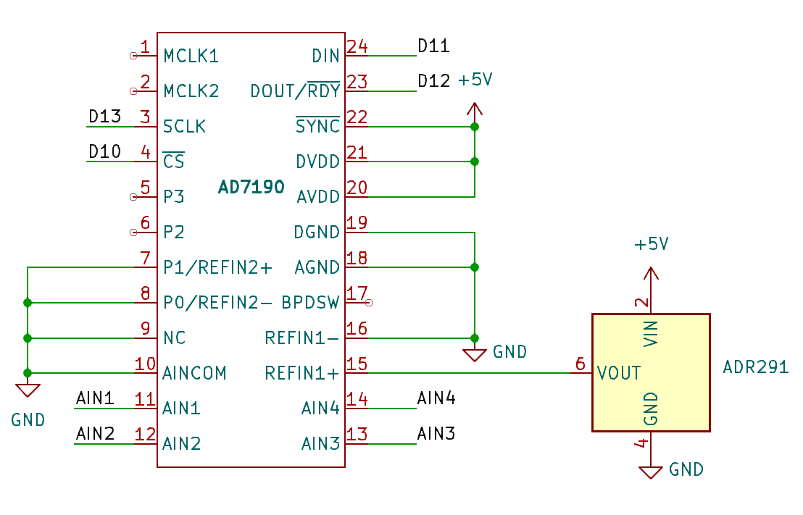

# AD7190
This is a library for interfacing with the AD7190 ADC using SPI on the Arduino UNO R4 minima and is based off of Kerry Wong's [AD770x library](http://www.kerrywong.com/2011/03/20/ad7705ad7706-library/). This was made for a personal project so there isn't functionality for every part of the chip, but there is enough to have a reasonable amount of control.

## Relevant information
For more information in some of the code, there are some comments that say refer to the datasheet. This can be found [here](https://www.analog.com/media/en/technical-documentation/data-sheets/ad7190.pdf). As of writing this, the current version is revision C so if it has changed, the page numbers in those comments may be incorrect.

This program works by using [SPI](https://www.analog.com/en/resources/analog-dialogue/articles/introduction-to-spi-interface.html) to read and write to the AD7190's on-chip registers. Each register represents a category of information about the chip and the bits of each register represent a particular piece of information within that category. For example, the communication register (datasheet p.19):
")
This register contains information for communicating with the chip and all communications start with a write to this register. As an example, bits CR3-5 contain the number of the next register you will access, so if you wanted to write to the mode register, you would write 001 (mode register code, datasheet p.19 table 15) to the CR3-5 bits, then send the information for the mode register on the next transfer.

## Example
Part of this library is an example called example.txt. Use the following wiring with this program to ensure it runs correctly:

## Installation instructions
To install this library, first download it as a zip file. Then open the [Arduino IDE](https://www.arduino.cc/en/software/) and navigate to Sketch > Include Library > Add .ZIP Library. Finally, select the file you just downloaded and you'll have it installed. Use `#include <AD7190.h>` to use it in your code.